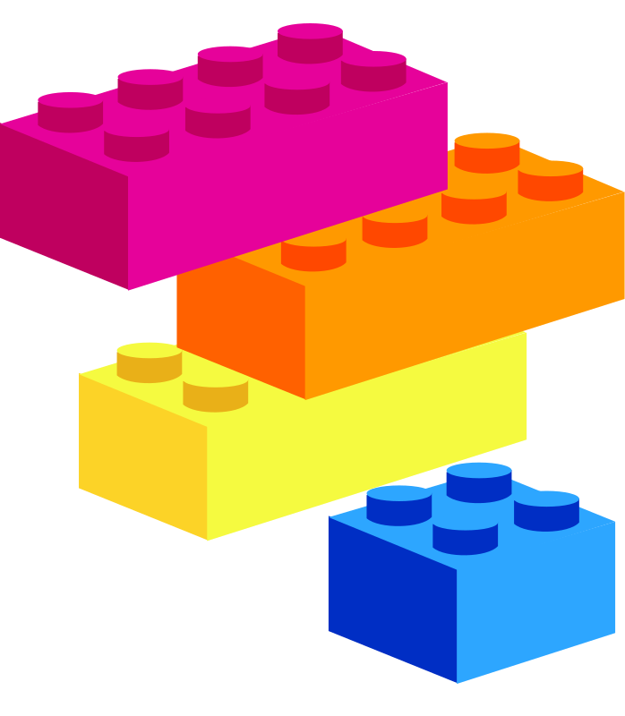

<p align="center">
    
</p>
<h1 align="center">
  Porunga
</h1>

## Introduction

Porunga is an experimental library of presentational components to be used across applications using ReactJS. It is intended to work as building blocks.

We hope to deliver an easy to use component API that can be easily extendable to fit the functional and design needs for multiple platforms and audiences.

This is a 2019 innovation sprint project that can either take off to be implemented into a larger design system, influence directions and tech for future React based projects, or simply be an experimental playground for approaching a react ui library.

## Tools Used

- [Emotion Styled](https://emotion.sh/docs/introduction)
  - Styled API
  - Themeing
- [TypeScript](https://www.typescriptlang.org/)
- [Style Guidist](https://react-styleguidist.js.org/)
- [Commitzen](https://commitizen.github.io/cz-cli/)
- [Snapshot Testing](https://jestjs.io/docs/en/snapshot-testing)

## 🏃 Get Running

This library uses Styleguidist as documentation and playground for developing components.

Must be running node version `12.6.0`

install packages running

`yarn`

run local playground

`yarn start`

## 🧪 Testing

### Snapshots

This project uses [react-test-renderer](https://github.com/facebook/react/tree/master/packages/react-test-renderer) to provide the ability to create rendered snapshots of components. These snapshots will be automatically generated every time a test suite has run. The reasoning behind this is to flag any changes to how a component is rendered. When running your test suite, if a diff between a component and it's snapshot is detected, the test suite will fail. If the diff was intentional, run `yarn test --u` to update your snapshots to an updated version.

Example usage:

```js
import React from 'react'
import Button from '../Button'
import renderer from 'react-test-renderer'

it('renders correctly', () => {
  const component = renderer.create(<Button />)

  let tree = component.toJSON()
  expect(tree).toMatchSnapshot()
})
```

### DOM

This project uses [react-testing-library](https://github.com/testing-library/react-testing-library) as a light-weight solution to testing React components. It comes with a lot less overhead than Enzyme, and works out-of-the-box with modern React APIs. We want to avoid testing any implementation details of components, and instead focus on testing functionality.

Example usage:

```js
test('checkboxes (and radios) must use click', () => {
  const handleChange = jest.fn()
  const { container } = render(
    <input type="checkbox" onChange={handleChange} />
  )
  const checkbox = container.firstChild

  fireEvent.click(checkbox)
  expect(handleChange).toHaveBeenCalledTimes(1)
  expect(checkbox.checked).toBe(true)
})
```

## 👔 Conventional Commits

This project follows [Conventional Commit](https://www.conventionalcommits.org/en/v1.0.0-beta.4/) specifications. The Husky `commit-msg` hook checks that commit messages adhere to these standards using [commitlint](https://github.com/conventional-changelog/commitlint).

### Commitizen

This project uses [Commitizen](https://github.com/commitizen/cz-cli) to generate commit messages that adhere to Conventional Commit specifications. To use Commitizen, run `yarn cz`. This will walk you through generating a commit messsage by prompting you to enter following:

- Commit type (feat, fix, docs, style, refactor, perf, test, build, ci, chore, revert)
- Scope (optional)
- Short description
- Long description (optional)
- Whether it produces any breaking changes
- Whether it closes any open issues

## Project Roadmap

- [ ] Kickoff first meeting!
- [ ] Brand the UI Library
- [ ] Plan Scope of components we want to cover
- [ ] Decide on a design to follow
- [ ] Finalize theme stucture and naming
